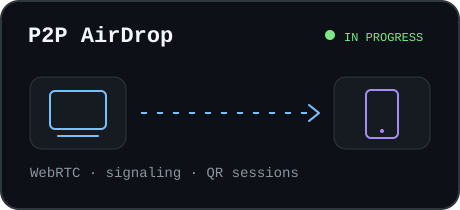
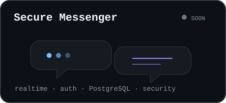

<p align="center">
  <picture>
    <source media="(prefers-color-scheme: dark)" srcset="./hero-dark.svg">
    <source media="(prefers-color-scheme: light)" srcset="./hero-light.svg">
    
  </picture>
</p>

<p align="center">
  <b>Frontend Developer · Intern · Student @ Hexlet College</b>
</p>

<p align="center">
  Building real projects and gradually moving deeper into Software Engineering.<br>
  Currently exploring architecture, networking, realtime communication and databases.
</p>

<br>

## Selected Work

<table>
<tr>

<td width="50%" valign="top">

<a href="https://github.com/mira973/p2p-AirDrop">
  <picture>
    <source media="(prefers-color-scheme: dark)" srcset="./airdrop-dark.svg">
    <source media="(prefers-color-scheme: light)" srcset="./airdrop-light.svg">
    
  </picture>
</a>

</td>

<td width="50%" valign="top">

<a href="https://github.com/mira973/secure-messenger">
  <picture>
    <source media="(prefers-color-scheme: dark)" srcset="./messenger-dark.svg">
    <source media="(prefers-color-scheme: light)" srcset="./messenger-light.svg">
    
  </picture>
</a>

</td>

</tr>
</table>

<br>

## Tech Stack

<p align="center">
  <picture>
    <source
      media="(prefers-color-scheme: dark)"
      srcset="https://skillicons.dev/icons?i=ts,js,react,postgres,docker,git,vite&theme=dark"
    >
    <source
      media="(prefers-color-scheme: light)"
      srcset="https://skillicons.dev/icons?i=ts,js,react,postgres,docker,git,vite&theme=light"
    >
    
  </picture>
</p>

<br>

## Current Focus

```text
01  Building complete projects instead of isolated demos
02  Going deeper into frontend architecture
03  Learning realtime communication and networking
04  Practicing databases through real applications
05  Improving Docker and deployment skills
```

<br>

<p align="center">
  <picture>
    <source media="(prefers-color-scheme: dark)" srcset="./footer-dark.svg">
    <source media="(prefers-color-scheme: light)" srcset="./footer-light.svg">
    
  </picture>
</p>
